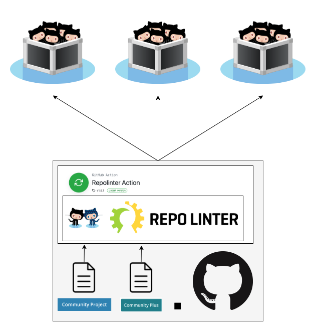

# Repolinter Runbook

[Repolinter](https://github.com/todogroup/repolinter) is a tool designed to automatically find and fix open source policy issues in a repository. At New Relic, we have deployed Repolinter to all of our public repositories to allow greater consistency in policy enforcement.

Repolinter is deployed through an instance of [Repolinter Action](https://github.com/newrelic/repolinter-action) either registered on the target repository or this repository. Each deployment of Repolinter action is given a link to the policy it should apply, allowing us to centrally manage policies in this repository. At the moment policies are split by category: this means that a repository making a category change requires modification of the Repolinter policy URL (see [deploying repolinter](#deploying-repolinter)), but changes to the policies enforced by each category only require updating the policy file (see [managing policies](#managing-policies)).

Instructions are provided below to deploy and maintain this system. Additionally, the [architecture overview](#architecture-overview) provides more technical details on how this system is constructed.

<!-- toc -->
- [Deploying Repolinter](#deploying-repolinter)
  - [Add Repolinter to a single repository](#add-repolinter-to-a-single-repository)
    - [Alternate deployment method](#alternate-deployment-method)
  - [Add Repolinter to many repositories](#add-repolinter-to-many-repositories)
  - [Change the policy for a repository](#change-the-policy-for-a-repository)
    - [Change policy for a central deployment](#change-policy-for-a-central-deployment)
- [Managing policies](#managing-policies)
  - [Policy editing tips](#policy-editing-tips)
  - [Creating a policy](#creating-a-policy)
  - [Modifying a policy](#modifying-a-policy)
- [Architecture overview](#architecture-overview)
  - [Repolinter Preamble](#repolinter-preamble)
  - [Repolinter Action](#repolinter-action)
    - [Decentralized method](#decentralized-method)
    - [Centralized method](#centralized-method)
  - [Future improvements](#future-improvements)
<!-- endtoc -->

## Deploying Repolinter


### Add Repolinter to a single repository

Repolinter Action can be added to a repository by opening a pull request against the target repository with the action workflow file. An [alternate method](#alternate-deployment-method) is also available for repositories that find PRs or GitHub actions difficult to work with.

1. Fork (or create a branch) on the target repository, and clone it locally so you can modify it.
2. Copy [`repolinter-action-template.yml`](./repolinter-action-template.yml) into `.github/workflows/repolinter.yml` in the cloned repository.
3. Edit the copied `repolinter.yml` and replace `<config url>` with a link to the desired policy.
   *  You can get this link by navigating to the policy file on GitHub and clicking the `raw` button in the file view (make sure you have `main` branch selected). The link will be formatted as `https://raw.githubusercontent.com/newrelic/.github/main/{path to policy}`. For example: `https://raw.githubusercontent.com/newrelic/.github/main/repolinter-rulesets/new-relic-one-catalog-project.json` for [`repolinter-rulesets/new-relic-catalog-project.json`](../repolinter-rulesets/new-relic-one-catalog-project.json).
4. Save the file, commit it, and push the changes. Commit message I typically use is `ci: add repolinter action workflow`.
5. Open a pull request with your changes. Use `ci: Add Open Source Policy Workflow` for the title and the text in [`pr-body.md`](./pr-body.md) for the body text.

#### Alternate deployment method

A centralized deployment of Repolinter exists in this repository under [.github/workflows/repolinter-apply.yml](../../.github/workflows/repolinter-apply.yml). This deployment serves as an alternative to the distributed workflow for teams that find it difficult to work with. Note that for this deployment to work properly `nr-opensource-bot` must have write permissions to the target repository.

1. Fork (or create a branch) on this repository, and clone it locally so you can modify it.
2. Edit `.github/workflows/repolinter-apply.yml`, adding the target repository and relative path to the policy under `jobs.apply-repolinter.strategy.matrix.include`. Save, commit, and push this file.
3. Contact a team member who can grant write permissions for the target repository to `nr-opensource-bot`.
4. Create a pull request with your changes to this repository. Make sure the checks pass before merging.

### Add Repolinter to many repositories

Adding Repolinter to many repositories requires opening a large number of identical pull requests. I recommend Google's [github-repo-automation](https://github.com/googleapis/github-repo-automation) to automate this process. Instructions to run this tool are below:

0. Make sure you have a GitHub account (or a token) with **write access** to every repository that you would like to add Repolinter to. This tool creates a branch on the target repository, and will fail if it cannot write.
   * In addition to a personal access token, your local `git` instance will need to be [setup with an SSH key](https://docs.github.com/en/free-pro-team@latest/github/authenticating-to-github/connecting-to-github-with-ssh) to allow cloning over SSH. The SSH key used must have the same permissions as the token.
1. Use `npm i -g @google/repo` to install the tool. You'll need NodeJS installed if it isn't already.
2. Find or create an empty workspace folder. I'll use `{work}` as the relative path to that workspace folder and `{work abs}` as the absolute path.
3. Copy [`repolinter-action-template.yml`](./repolinter-action-template.yml) to `{work}/repolinter.yml` and [`pr-body.md`](./pr-body.md) to `{work}/pr-body.md`. 
4. Edit the copied `{work}/repolinter.yml` and replace `<config url>` with a link to the desired policy.
   *  You can get this link by navigating to the policy file on GitHub and clicking the `raw` button in the file view (make sure you have `main` branch selected). The link will be formatted as `https://raw.githubusercontent.com/newrelic/.github/main/{path to policy}`. For example: `https://raw.githubusercontent.com/newrelic/.github/main/repolinter-rulesets/new-relic-one-catalog-project.json` for [`repolinter-rulesets/new-relic-catalog-project.json`](../repolinter-rulesets/new-relic-one-catalog-project.json).
5. Create a `.repo.yml` file in `{work}`, and paste in the following contents:
   ```yaml
   githubToken: <token>
   clonePath: ./.work
   repos:
   -  org: <org>
      name: <name>
   # more repositories here
   ```
6. Generate a [GitHub personal access token](https://docs.github.com/en/free-pro-team@latest/github/authenticating-to-github/creating-a-personal-access-token) using the account you would like to make the PRs as. Check the `public_repo` scope when creating this token. When complete, replace `<token>` in `.repo.yml` with the generated value.
7. Replace the template under `repos` with the list of repositories you would like to add Repolinter to. You may want to use a scripting language to generate the YAML formatting for this list, as it can get rather long. An example complete configuration is shown below:
   ```yaml
   githubToken: df51c00f76bcd3a0e586d02d40bcd314a2456213
   clonePath: ./.work
   repos:
   -  org: newrelic
      name: repolinter-action
   -  org: newrelic
      name: .github
   # ...
   ```
8. Replace `{work abs}` with the absolute path to your working directory in the following command, then run it to start automatically creating PRs:
   ```sh
   REPO_CONFIG_PATH=./.repo.yml repo apply --silent --branch feature/repolinter-action --message "ci: Add Open Source Policy Workflow" --comment "$(< ./pr-body.md)" "mkdir -p .github/workflows && cp /{work abs}/repolinter.yml .github/workflows/repolinter.yml"
   ```
9. Watch the output for errors. If all goes well, you should see text like this for every repository:
   ```console
   Loaded 1 repositories from GitHub.
   Total 1 unique repositories loaded.
   companion-cube
   Executing command: mkdir -p .github/workflows && cp /Users/nkoontz/Documents/code/github-repo-automation-rollout/repolinter.yml .github/workflows/repolinter.yml
      success! https://github.com/aperture-science-incorporated/companion-cube/pull/54
   ```
   Some common problems:
     * `git@github.com: Permission denied (publickey).` - Git is not able to authenticate to GitHub over SSH. Is your git instance setup with an SSH key?
     * `cannot create branch feature/repolinter-action, skipping this repository: Error: Request failed with status code 404` - The Personal Access Token does not have permissions to write to this repository. Check that the `public_repo` scope and granted and the user has write permissions to the repository.
     * `cannot create branch feature/repolinter-action, skipping this repository: Error: Request failed with status code 422` - A branch named `feature/repolinter-action` already exists on this repository. Is there already a PR for Repolinter Action open?
     * `GaxiosError: Request failed with status code 401` - Check the Personal Access Token. Is the token pasted correctly? Does it have the permissions needed?
     * `Config file not found` - Check that you are running the command in `{work}`, and that the `.repo.yml` file is formatted correctly (use www.yamllint.com to check syntax).
     * `Action returned empty array` - The repolinter workflow file is already present on this repository, did you already apply Repolinter?
     * `Callback function threw an exception` - Check that the absolute path in the command is correct, and that `{work}/repolinter.yml` is readable by the tool.

### Change the policy for a repository

**Note:** If you are changing the policy for repository, make sure any also change the category for that repository in the [Opensource Website](https://github.com/newrelic/opensource-website).

The process to change the Repolinter policy will depend on how Repolinter is deployed on that repository. If there is a `.github/workflows/repolinter.yml` workflow file in the repository, use the steps below. If the repository is listed in this repository's [`.github/workflows/repolinter-apply.yml`](../../.github/workflows/repolinter-apply.yml), use the steps listed under [change policy for a central deployment](#change-policy-for-a-central-deployment). If neither of these conditions are met, Repolinter has not yet been deployed on the repository--follow the steps under [add Repolinter to a single repository](#add-repolinter-to-a-single-repository) to setup Repolinter for the first time.

1. Fork (or create a branch) on the target repository, and clone it locally so you can modify it.
2. Use GitHub to find the new policy file you would like to use, and get a link to the raw file.
   *  You can get this link by navigating to the policy file on GitHub and clicking the `raw` button in the file view (make sure you have `main` branch selected). The link will be formatted as `https://raw.githubusercontent.com/newrelic/.github/main/{path to policy}`. For example: `https://raw.githubusercontent.com/newrelic/.github/main/repolinter-rulesets/new-relic-one-catalog-project.json` for [`repolinter-rulesets/new-relic-catalog-project.json`](../repolinter-rulesets/new-relic-one-catalog-project.json).
3. Edit the target repositories `.github/workflows/repolinter.yml`, replacing the `with.config_url` in the `Run Repolinter` step with the URL to the policy you found earlier.
4. Commit, push, and create a pull request with your changes.

#### Change policy for a central deployment

1. Fork (or create a branch) on this repository, and clone it locally so you can modify it.
2. Find the target repository in [`.github/workflows/repolinter-apply.yml`](../../.github/workflows/repolinter-apply.yml). Replace the `config` key for the target repository with the relative path to the desired policy (ex. `repolinter-rulesets/community-plus.yml`).
3. Commit, push, and create a pull request with your changes.

## Managing policies

Policies for this system are managed centrally in this repository under `repolinter-rulesets`. More specifically, Repolinter action pulls a new copy of the policy from this repository every time it is invoked. Policies are split into separate files by [OSS category](https://opensource.newrelic.com/oss-category/)--as changing which file Repolinter action pulls requires [modifying the target repository](#change-the-policy-for-a-repository), this means that a category change will typically require help from the OSPO.

### Policy editing tips

All policies are structured according to the [Repolinter documentation](https://github.com/todogroup/repolinter#creating-a-ruleset). YAML is preferred for readability. Some tips when creating or modifying rulesets:
 * Start with an existing policy, and modify it as needed. You can use either one in this repository or the [one built into Repolinter](https://github.com/todogroup/repolinter/blob/master/rulesets/default.json).
   * If you go this route, make sure you edit out all of the references to the previous policy. I will typically use my IDE to find all the instances of the previous category name so I don't miss anything.
 * Use a YAML linter to catch common syntax issues. IDE's will typically have a built-in syntax checker, but I also use www.yamllint.com or codebeautify.org/yaml-validator to validate my YAML.
 * Attempt to be as generic as possible when writing rules. For instance, instead of checking for a specific `README.md` subsection called `### security`, simply search any `README*` file for a substring that the security section should contain. New Relic has a very wide variety of repository structures and contents, and checking for the spirit of the rule will result in the minimum number of rewrites.
   * On that note, ensure that `README*` rules support both Markdown and [RST](https://docutils.sourceforge.io/rst.html). [Example of an RST README](https://github.com/newrelic/newrelic-python-agent/blob/main/README.rst).
 * As of writing repolinter action does not support using the language or license axioms.
 * Fill the `policyInfo` field with as much information as you can. It is not only helpful to the person receiving the error but also serves as a reminder for the reason the rule was put in place.
 * Remember to double check the links!

### Creating a policy

1. Fork (or create a branch) on the target repository, and clone it locally so you can modify it.
2. Create a YAML file in `repolinter-rulesets` with the desired policy name. I typically use the OSS category names as specified in the [opensource website](https://github.com/newrelic/opensource-website/blob/develop/src/data/oss-category/oss-category.json).
3. Edit the new policy with your desired checks. Check out the [Repolinter documentation](https://github.com/todogroup/repolinter#creating-a-ruleset) and [policy editing tips](#policy-editing-tips) to get started.
4. Add your policy file to the [`.github/workflows/test.yml`](../../.github/workflows/test.yml) workflow to allow GitHub actions to test it.
5. Commit, push, and create a pull request with your new policy file. Wait for the pull request checks to pass before merging.

### Modifying a policy

1. Fork (or create a branch) on the target repository, and clone it locally so you can modify it.
2. Make the desired changes to a policy file. Check out the [Repolinter documentation](https://github.com/todogroup/repolinter#creating-a-ruleset) and [policy editing tips](#policy-editing-tips) for tips on editing.
3. Commit, push, and create a pull request with your changes. Wait until the pull request checks pass before merging.
4. Policy changes will rollout immediately, but Repolinter Action will not pull the changes until the next push to the default branch of the target repository.
   * To force Repolinter Action to pull immediately: navigate to the target repository's GitHub Actions, find the latest `Repolinter Action` run on the default branch, and click `Re-run jobs`. Note that you will need write access to the target repository to perform this action.

## Architecture overview

### Repolinter Preamble

Repolinter is a maintained by the [TODOGroup](https://todogroup.org/) and was created to "Lint open source repositories for common issues.". When Repolinter was first evaluated for this project, it was missing key functionality that prevented it from being deployment ready: primarily the ability to automatically fix problems it found, but additionally readability issues with the output and configuration. As a result, a large chunk of the work of deploying Repolinter went towards modifications to Repolinter itself. These modifications were made on a [forked version of Repolinter](https://github.com/newrelic-forks/repolinter), and then later [PRed back into the TODOGroup repository](https://github.com/todogroup/repolinter/pull/174) after the first round of Repolinter action deployments went well. Because of this, **Repolinter Action is based on the [newrelic-forks version of Repolinter](https://github.com/newrelic-forks/repolinter)** and not on the TODOGroup repository. This decision stems from the need to deploy changes to Repolinter quickly if a problem occurs. Since we maintain our own fork, we can proceed with relative autonomy—as good open source citizens, however, I encourage you to always attempt to bring changes from our fork into the TODOGroup version and vice versa. (It should be noted that TODOGroup has indicated to me [@prototypicalpro] that they would eventually like to absorb Repolinter Action into their organization, in which case our Repolinter fork would no longer be necessary.)

### Repolinter Action

At NR Repolinter is deployed via [Repolinter Action](https://github.com/newrelic/repolinter-action). Repolinter action is a [GitHub Action](https://docs.github.com/en/free-pro-team@latest/actions/learn-github-actions) that runs Repolinter with a target policy against a target repository—in other words, Repolinter action packages Repolinter into a module that can be directly invoked in a GitHub Actions CI pipeline. 

There are two methods we created for deploying repolinter action: decentralized and centralized. The decentralized method is preferred, however the centralized method is a suitable alternative for repositories that prefer to not deal with GitHub Actions.

#### Decentralized method


In the decentralized method, each repository has a GitHub actions workflow file that runs Repolinter action on push to the default branch. By default, the workflow file is configured to open an issue if the policy does not pass, but will not "break the build" in any other manner. This workflow file also specifies a URL to a centralized policy file stored in the [newrelic/.github](https://github.com/newrelic/.github) repository, which is pulled fresh every time Repolinter action is run. There are some consequences of this architecture that are worth pointing out:
 * Deployment to a large number of repositories is a highly involved task, but does not require write permissions to any of the repositories (assuming a fork PR deployment). In practice this advantage cannot be realized due to limitations of the tooling.
 * Results aggregation (how many repolinter issues) must be done using GitHub's search API or otherwise.
 * The developers of the target repository have ownership over the Repolinter workflow file. This was an intentional choice, and the workflow file is meant to be helpful rather than required.
 * As the policy is centralized but the *policy url* is not, changing the policy contents requires changing the .github repository but changing which policy is being applied to a repository requires changing the workflow file in the repository itself.

#### Centralized method



In the centralized method, the newrelic/.github repository has a single [repolinter workflow file](../../.github/workflows/repolinter-apply.yml) which uses Repolinter action to apply Repolinter to a list of other external repositories. A policy is specified with each repository in the workflow file. This method was created for repositories that prefer not to have GitHub actions workflows. Some consequences of this method:
* The `nr-opensource-bot` machine user must have write permissions to every target repository, creating a security issue if the list is large.
* Both policy content and type changes are performed in the .github repository.

### Future improvements

Below is a list of ideas for improvement of this system, in no particular order:
 * Repolinter has a concept called [axioms](https://github.com/newrelic-forks/repolinter#axioms) which allow a rule in a policy to only run if certain conditions (such as a language or license) are satisfied. This feature could allow for more specific policies to be made in the future, or for merging all of the current policy into one policy with many conditionals.
 * Repolinter also has the ability to perform automatic fixes based on policy outcomes. It was originally suggested that Repolinter Action open a PR with these fixes—this feature was backlogged in favor of simply opening an issue to prevent the possibility of erroneous PRs causing confusion.
 * The tool used for the deployment of repolinter action to many repositories ([@google/repo](https://github.com/googleapis/github-repo-automation)) requires write access to all the repositories it is deploying too. This problem could be fixed by adding fork-PR support to the tool.